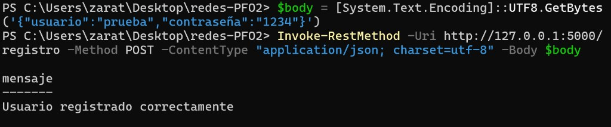
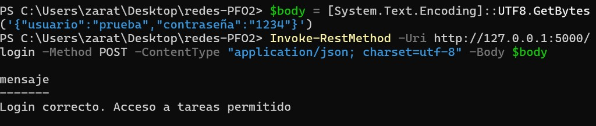
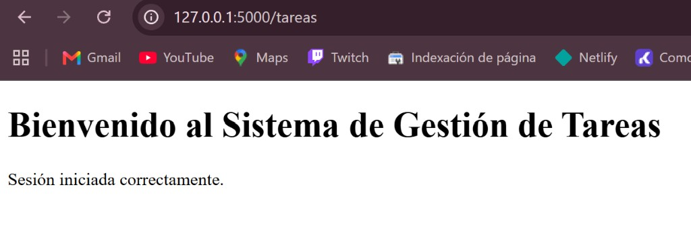

# Sistema de Gestión de Tareas con API y Base de Datos

PFO 2 - API con Flask, autenticación básica y SQLite.

- Repositorio: https://github.com/zarateCarlos/sistema-gestion-tareas-api-base-de-datos
- GitHub Pages: https://zaratecarlos.github.io/sistema-gestion-tareas-api-base-de-datos/

## Requisitos

- Python 3
- Flask (`pip install -r requirements.txt`)

## Cómo ejecutar

```bash
pip install -r requirements.txt
python servidor.py
```

El servidor corre en: http://127.0.0.1:5000

## Cómo probar

### Registro - POST /registro

Body JSON:

```json
{
  "usuario": "nombre",
  "contraseña": "1234"
}
```

PowerShell (con UTF-8 por la ñ de contraseña):

```powershell
$body = [System.Text.Encoding]::UTF8.GetBytes('{"usuario":"nombre","contraseña":"1234"}')
Invoke-RestMethod -Uri http://127.0.0.1:5000/registro -Method POST -ContentType "application/json; charset=utf-8" -Body $body
```

### Login - POST /login

```powershell
$body = [System.Text.Encoding]::UTF8.GetBytes('{"usuario":"nombre","contraseña":"1234"}')
Invoke-RestMethod -Uri http://127.0.0.1:5000/login -Method POST -ContentType "application/json; charset=utf-8" -Body $body
```

### Tareas - GET /tareas

Abrir en el navegador:

http://127.0.0.1:5000/tareas

## Capturas de pruebas exitosas

Las imágenes están en la carpeta `capturas/`.

### POST /registro



### POST /login



### GET /tareas



## Respuestas conceptuales

### ¿Por qué hashear contraseñas?

Si se guarda la contraseña en texto plano y alguien entra a la base de datos, puede leerla directo. Al hashearla se guarda un valor transformado que no se puede revertir fácilmente. En este proyecto uso `generate_password_hash` y `check_password_hash` de Werkzeug.

### Ventajas de usar SQLite en este proyecto

- No hace falta instalar un servidor de base de datos.
- Los datos se guardan en un archivo local.
- Es simple de usar con Python (`sqlite3`).
- Alcanza bien para un trabajo práctico chico.

## Archivos

- `servidor.py` - API Flask + SQLite
- `requirements.txt` - dependencias
- `capturas/` - capturas de pruebas exitosas
- `docs/` - página de GitHub Pages
